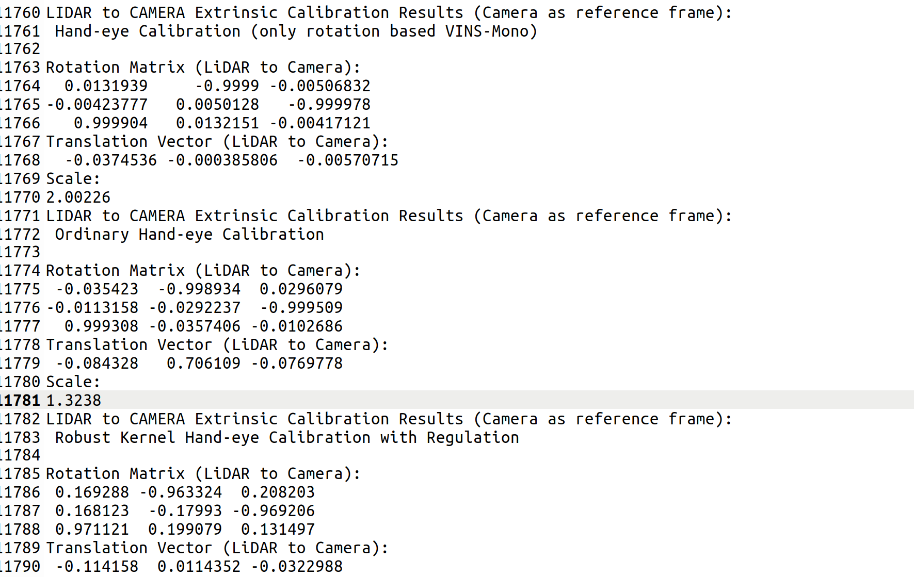

# LCC_init
LiDAR camera extrinsic parameter initialization calibration
This is a motion-based coarse calibration method for LiDAR-camera extrinsic parameters, with input being a monocular visual odometry and a LiDAR-only odometry.
 

## 1. Prerequisites
#### 1. ubuntu and ROS
#### 2. PCL Ceres G2O
#### 3. LiDAR-only odometry
#### 4. monocular visual  odometry

## 2. catkin_make
```bash
git clone https://github.com/af-doom/LCC_init.git
```
```bash
cd LCC_motion && catkin_make
```
Enter the following folders to modify "LIDAR_ODOM" and "Camera_odom" parameters
```bash
cd LCC_motion/src/LCC_motion/launch/livox_avia.launch
```
## 3. coarse calibration 
#### 1.Start calibration node
```bash
roslaunch lcc_motion livox_avia.launch
```
#### 2.Start LiDAR-only odometry node, for example
[I2EKF-LO](https://github.com/YWL0720/I2EKF-LO)  

#### 3.Start monocular visual  odometry  node, for example
[orb_slam3_ros](https://github.com/thien94/orb_slam3_ros)

#### 4.Result
```bash
cd LCC_motion/src/LCC_motion/ressults
```
It is recommended to use "Hand-Eye Calibration (only Rotation Based Vins-Mono)"

